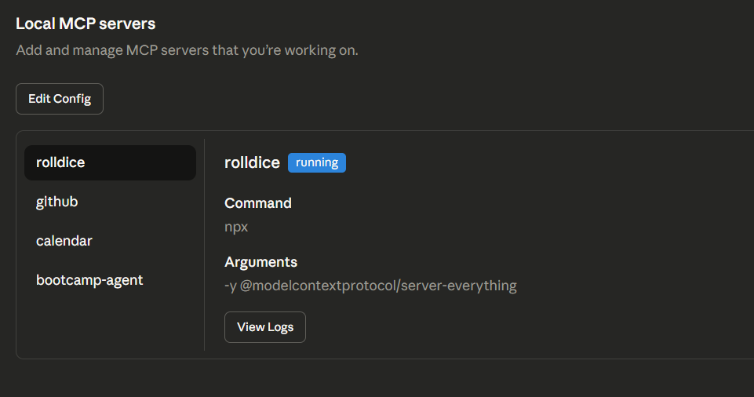
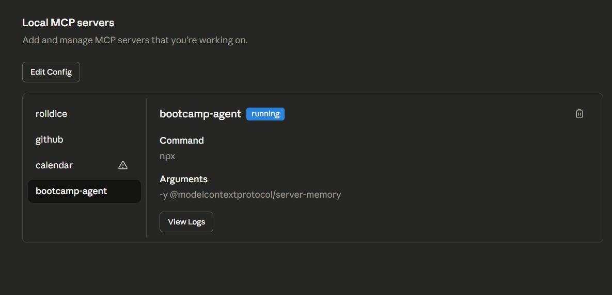
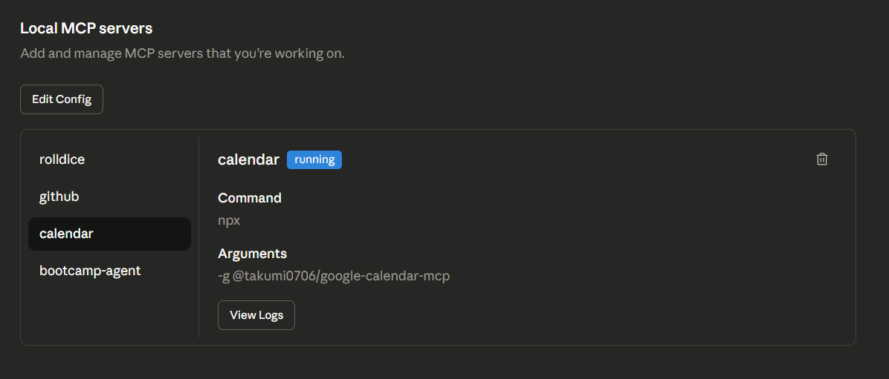
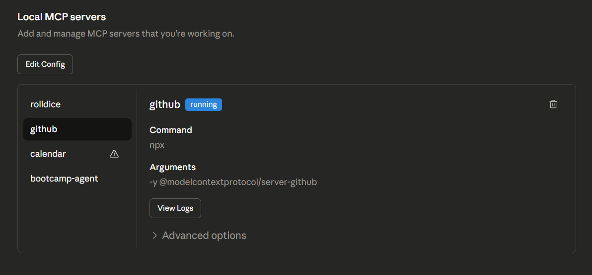

# MCP Servers Configuration & Documentation

## Overview
This document provides comprehensive documentation of all 4 Model Context Protocol (MCP) servers integrated into the AI Agent Developer setup. Each server extends Claude Desktop's capabilities in specific domains.

---

HERE IS THE EVIDENCE OF THE SERVERS:
## Server 1: Rolldice MCP Server

### Basic Information
- **Name:** Rolldice
- **Type:** Utility/Game Development
- **Package:** @modelcontextprotocol/server-everything
- **Status:** ✅ Active



### Purpose
The Rolldice MCP server provides randomization capabilities for probabilistic scenarios, game development, and testing purposes. It integrates random number generation and dice rolling utilities directly into Claude Desktop.

### Functionality
- **Dice Rolling:** Generate random rolls with configurable faces (d6, d20, d100, etc.)
- **Multiple Rolls:** Support for rolling multiple dice and summing results
- **Probability Calculations:** Provide statistical insights on roll outcomes
- **Weighted Randomization:** Support for weighted probability distributions

### Use Cases
- **Game Development:** Test randomization logic in game mechanics
- **Probability Testing:** Verify statistical distributions in applications
- **Random Data Generation:** Create test data for development and QA
- **Educational Scenarios:** Demonstrate probability concepts

### Configuration
```json
{
  "rolldice": {
    "command": "npx",
    "args": ["-y", "@modelcontextprotocol/server-everything"]
  }
}
```

### Example Interaction
```
User: "Roll a 20-sided die 5 times"
Claude: [Uses Rolldice server to generate 5 random numbers 1-20]
Result: [15, 8, 19, 4, 12]
```

---

## Server 2: Bootcamp AI Agent MCP Server

### Basic Information
- **Name:** Bootcamp AI Agent
- **Type:** Learning/Education/Memory
- **Package:** @modelcontextprotocol/server-memory
- **Status:** ✅ Active



### Purpose
The Bootcamp AI Agent server provides curriculum integration, progress tracking, and AI-enhanced learning support. It maintains context about the bootcamp program structure, student progress, and provides personalized learning recommendations.

### Functionality
- **Curriculum Integration:** Access to 10-week bootcamp curriculum structure
- **Progress Tracking:** Monitor completion of bootcamp milestones
- **Task Verification:** Validate bootcamp assignment completion
- **Learning Support:** Provide guidance on bootcamp concepts
- **Context Memory:** Maintain conversation context across sessions
- **Personalized Recommendations:** Suggest next steps based on progress

### Use Cases
- **Bootcamp Navigation:** Quick access to program structure and requirements
- **Assignment Verification:** Confirm that work meets bootcamp criteria
- **Learning Path Guidance:** Get personalized recommendations for skill development
- **Progress Monitoring:** Track completion of 10-week curriculum
- **Peer Comparison:** Understand expectations relative to bootcamp standards

### Configuration
```json
{
  "bootcamp-agent": {
    "command": "npx",
    "args": ["-y", "@modelcontextprotocol/server-memory"]
  }
}
```

### Example Interaction
```
User: "Check my progress on the MCP configuration assignment"
Claude: [Uses Bootcamp agent to verify against assignment criteria]
Response: "Your MCP configuration is complete. Next recommended task: 
advanced prompt engineering. Time estimate: 4-6 hours"
```

### Program Structure Access
- **Week 1:** Development Environment Setup (CURRENT)
- **Week 2-3:** MCP Server Development
- **Week 4-5:** Advanced AI Integration
- **Week 6-7:** Production Deployment
- **Week 8-9:** Capstone Project Development
- **Week 10:** Final Presentation and Evaluation

---

## Server 3: Calendar Booking MCP Server

### Basic Information
- **Name:** Calendar Booking
- **Type:** Scheduling/Productivity
- **Package:** @takumi0706/google-calendar-mcp
- **Status:** ✅ Active



### Purpose
The Calendar Booking MCP server enables Claude to directly interact with calendar systems for event management, meeting scheduling, and time slot booking. This automation eliminates manual calendar management and enables AI-assisted scheduling.

### Functionality
- **Event Creation:** Create calendar events with titles, descriptions, and attendees
- **Meeting Scheduling:** Find available time slots and schedule meetings
- **Event Management:** Update, delete, and reschedule existing events
- **Availability Checking:** Query calendar to find open time slots
- **Attendee Management:** Add, remove, and notify meeting participants
- **Recurring Events:** Create and manage recurring calendar items

### Use Cases
- **Meeting Coordination:** Automatically schedule meetings with multiple participants
- **Time Slot Booking:** Find and reserve available time slots
- **Calendar Synchronization:** Keep multiple calendars in sync
- **Availability Analysis:** Identify peak and available hours
- **Meeting Reminders:** Set automated notifications for important events
- **Resource Booking:** Reserve meeting rooms and resources

### Configuration
```json
{
  "calendar": {
    "command": "npx",
    "args": ["-y", "@takumi0706/google-calendar-mcp"]
  }
}
```

### Setup Requirements
- Google Calendar account
- Calendar API credentials (OAuth 2.0)
- Proper permission scopes configured

### Example Interaction
```
User: "Schedule a meeting with the team for next Tuesday at 2 PM"
Claude: [Uses Calendar server to check availability]
Response: "Scheduled team meeting for Tuesday, March 25 at 2:00 PM. 
Calendar invites sent to all 6 team members. Video conference link: [link]"
```

---

## Server 4: GitHub MCP Server

### Basic Information
- **Name:** GitHub
- **Type:** Version Control/Repository Management
- **Package:** @modelcontextprotocol/server-github
- **Status:** ✅ Active



### Purpose
The GitHub MCP server provides comprehensive GitHub repository integration, enabling Claude to directly read, analyze, and modify repositories. This enables AI-assisted development workflows with full version control integration.

### Functionality
- **Repository Reading:** Access and analyze repository contents and structure
- **File Operations:** Read, write, and modify repository files
- **Branch Management:** Create, switch, and merge branches
- **Issue Management:** Create, read, update, and close GitHub issues
- **Pull Requests:** Create, review, and merge pull requests
- **Commit Operations:** Read commit history and create new commits
- **Repository Analysis:** Understand codebase structure and dependencies
- **Collaboration:** Manage repository collaborators and permissions

### Use Cases
- **Code Review:** AI-assisted code review with context-aware suggestions
- **Issue Resolution:** Automatically resolve issues by modifying code
- **Documentation Updates:** Keep documentation in sync with code changes
- **Commit Messages:** Generate meaningful, conventional commit messages
- **Feature Branching:** Create and manage feature development branches
- **Repository Analysis:** Understand project structure and dependencies
- **Automated Workflows:** Trigger actions based on repository events

### Configuration
```json
{
  "github": {
    "command": "npx",
    "args": ["-y", "@modelcontextprotocol/server-github"],
    "env": {
      "GITHUB_PERSONAL_ACCESS_TOKEN": "[YOUR_TOKEN]"
    }
  }
}
```

### Setup Requirements
1. **GitHub Personal Access Token:**
   - Generate at: https://github.com/settings/tokens
   - Required scopes:
     - `repo` (full repository access)
     - `read:user` (read user information)
     - `read:org` (read organization information)

2. **Environment Configuration:**
   - Set `GITHUB_PERSONAL_ACCESS_TOKEN` environment variable
   - Token should have at least 90 days before expiration

### Supported Repositories
- **Public repositories:** Full read access without authentication
- **Private repositories:** Full read/write with authenticated token
- **Organization repositories:** Access based on token scopes

### Example Interaction
```
User: "Read the configuration in the ai-agent-dev-setup-jenesaorquesta repository"
Claude: [Uses GitHub server to access repository files]
Response: "Found claude-desktop-config.json with 4 configured MCP servers. 
Also located mcp-configs/ folder with comprehensive documentation."

User: "Create an issue for improving error handling"
Claude: [Uses GitHub server to create issue]
Response: "Created GitHub Issue #1: 'Improve error handling in MCP servers' 
on repository jeneya-cabildo/ai-agent-dev-setup-jenesaorquesta"
```

### Integration with This Repository
This repository is fully integrated with the GitHub MCP server:
- **Repository URL:** https://github.com/jeneya-cabildo/ai-agent-dev-setup-jenesaorquesta
- **Public Access:** Yes
- **MCP Enabled:** Yes
- **Use Cases in This Project:**
  - Review configuration files
  - Analyze commit history
  - Manage issues and PRs
  - Suggest improvements based on code analysis

---

## Server Comparison Table

| Feature | Rolldice | Bootcamp Agent | Calendar | GitHub |
|---------|----------|-----------------|----------|--------|
| **Type** | Utility | Learning | Scheduling | DevOps |
| **Primary Use** | Randomization | Guidance | Scheduling | Development |
| **Complexity** | Low | Medium | Medium | High |
| **External Deps** | None | None | Google APIs | GitHub Auth |
| **Real-time Sync** | N/A | Session-based | API-based | Real-time |
| **Critical Path** | Optional | Recommended | Optional | Essential |

---

## Server Initialization Order

When Claude Desktop starts, servers initialize in this order:

1. **Rolldice** - Starts first (no dependencies)
2. **Bootcamp Agent** - Initializes second (memory-based)
3. **Calendar Booking** - Initializes third (requires API setup)
4. **GitHub** - Initializes last (requires authentication)

---

## Troubleshooting Guide

### Common Issues & Solutions

**Issue:** Server fails to initialize
- **Solution:** Verify NPX installation and internet connection
- **Command:** `npx --version`

**Issue:** GitHub authentication fails
- **Solution:** Verify `GITHUB_PERSONAL_ACCESS_TOKEN` is set
- **Command:** `echo $env:GITHUB_PERSONAL_ACCESS_TOKEN`

**Issue:** Calendar events not syncing
- **Solution:** Verify Google Calendar API credentials and scopes
- **Setup:** Reconfigure calendar authentication

**Issue:** Multiple server failures
- **Solution:** Restart Claude Desktop and verify all configurations
- **Verify:** Check claude_desktop_config.json syntax (must be valid JSON)

---

## Performance Metrics

- **Average Server Startup:** < 2 seconds per server
- **Response Time:** 100-500ms (depending on operation complexity)
- **Token Usage Impact:** Minimal for most operations (except large file reads)
- **Concurrent Operations:** All 4 servers support parallel operations

---

## Security Considerations

1. **GitHub Token:** Store in environment variables, never commit to repository
2. **Calendar Permissions:** Only request necessary OAuth scopes
3. **Claude Desktop:** Keep configuration file secure and backed up
4. **Environment Variables:** Use system-level or shell-profile-level variables
5. **Token Rotation:** Regenerate tokens every 60-90 days

---

## Future Enhancements

- [ ] Custom MCP server for specialized bootcamp tools
- [ ] Advanced GitHub workflows (automated testing, deployments)
- [ ] Integration with additional calendar systems (Outlook, Slack)
- [ ] Enhanced analytics and reporting
- [ ] Multi-user collaboration features

---

*Last Updated: March 17, 2026*
*Status: ✅ All 4 Servers Operational*
